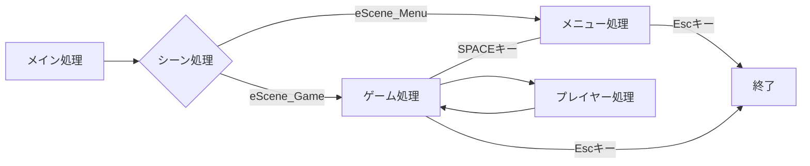

# じゃんけんゲーム
初心者向けで1～2時間想定の簡単なじゃんけんゲームの作り方をご紹介します。

## 目次
1. [初めに](./1Jindex.html)
2. [プロジェクト作成](./2JMakeProject.html)
3. [画面遷移作成](./3Scene.html)
4. [メニュー画面作成](./4Menu.html)
5. [ゲーム画面作成](./5Game.html)
6. [最後に](./6Final.html)
---

### 完成
ゲーム画面作成が完了したら完成

#### キーボード処理説明

| 画面 | キーボード | 処理 |
| --- | --- | --- |
| 全画面 | ESC | 強制終了 |
| メニュー | スペース | ゲーム画面移動 |
| ゲーム | 1 | ぐー |
| ゲーム | 2 | ちょき |
| ゲーム | 3 | ぱー |
| ゲーム | スペース | 再度ゲーム開始 |

#### プログラム処理（シーケンス図）

### 最後に
本スレッドは初心者向けなのでただ動かすだけであまり要素を追加していません。
これを機会にもっと面白いゲームを作りたいと思ってくれたら、Youtubeや作り方を検索してゲームをたくさん作ってくれるとうれしいです。

---
[前へ戻る](./5Game.html)

[DxLib開発ページへ戻る](../Dindex.html)